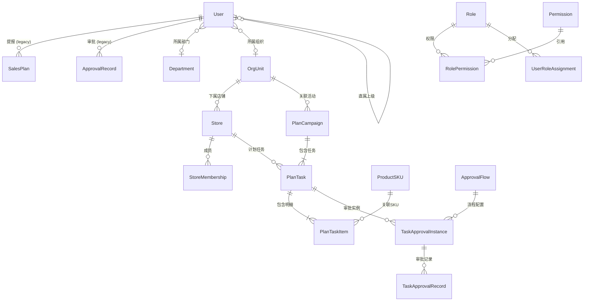

# 销售计划提报系统 (Sales Plan System)

> 美妆电商 M+4 销售计划管理与审批系统

**最后更新**: 2026-03-28

---

## 项目概览

本项目是一个面向美妆电商的**销售计划提报与审批管理系统**，采用 Django + HTMX + TailwindCSS 技术栈，实现了**M+4滚动预测**提报、基于活动的计划管理、多级可配置审批流程、RBAC 权限控制和数据报表统计功能。

### 核心业务流程

```
管理员创建活动(PlanCampaign) → 为店铺生成任务(PlanTask) → 填报人编辑SKU明细(PlanTaskItem)
→ 提交审批 → 多级审批(可配置) → 已批准
                                    ↓
                              退回/驳回 ←───┘
```

---

## 技术栈

| 类别 | 技术 |
|------|------|
| 后端框架 | Django 4.2 |
| 前端交互 | HTMX + Alpine.js |
| CSS 框架 | TailwindCSS (CDN) |
| 数据库 | SQLite (开发) / PostgreSQL (生产) |
| 数据处理 | pandas, openpyxl, python-dateutil |
| Admin 主题 | unfold |
| 生产服务 | gunicorn + whitenoise |

---

## 项目结构

```
sales_plan_system/
├── config/                    # 项目配置
│   ├── settings.py           # Django 设置
│   ├── urls.py               # 根路由
│   ├── wsgi.py               # WSGI 配置
│   ├── health_views.py       # 健康检查端点
│   ├── middleware.py          # 自定义中间件
│   ├── app_config.py         # 应用配置
│   └── settings_env.py       # unfold 环境回调
├── core/                      # 核心业务模块
│   ├── errors.py             # 类型化错误层次结构
│   ├── users/                # 用户管理模块
│   │   ├── models.py         # User, Department, OrgUnit, Store, StoreMembership
│   │   ├── views.py          # 用户资料视图
│   │   └── urls.py           # 用户路由
│   ├── products/             # 商品管理模块
│   │   ├── models.py         # Brand, Category, ProductSKU
│   │   ├── views.py          # SKU CRUD, 导入导出
│   │   ├── selectors.py      # SKU 查询/分页
│   │   └── urls.py           # 商品路由
│   ├── plans/                # 计划提报模块
│   │   ├── models.py         # SalesPlan*, PlanCampaign, PlanTask, PlanTaskItem
│   │   ├── views.py          # 活动/任务CRUD, 矩阵编辑, 报表
│   │   ├── services.py       # 任务业务逻辑服务
│   │   ├── selectors.py      # 查询逻辑
│   │   └── urls.py           # 计划路由
│   ├── approvals/            # 审批流程模块
│   │   ├── models.py         # ApprovalRecord, ApprovalFlow, TaskApprovalInstance/Record
│   │   ├── views.py          # 审批操作, 批量审批
│   │   ├── services.py       # 审批业务逻辑
│   │   └── urls.py           # 审批路由
│   ├── permissions/          # RBAC 权限模块
│   │   ├── models.py         # Role, Permission, RolePermission, UserRoleAssignment, DataScopeRule, etc.
│   │   ├── views.py          # 权限中心
│   │   ├── services.py       # 权限服务
│   │   ├── decorators.py     # @page_access_required 装饰器
│   │   ├── context_processors.py # 导航菜单权限
│   │   └── urls.py           # 权限路由
│   ├── mechanisms/           # 促销机制 (空壳占位)
│   ├── analytics/            # 数据分析 (空壳占位)
│   └── integrations/         # 外部集成 (空壳占位)
├── templates/                 # 前端模板 (35个)
│   ├── base.html             # 基础布局 (侧边栏 + 审批徽章轮询)
│   ├── dashboard.html        # 首页看板
│   ├── users/                # 用户模板
│   ├── products/             # 商品模板
│   ├── plans/                # 计划模板 (含 legacy + campaign)
│   ├── approvals/            # 审批模板
│   ├── permissions/          # 权限模板
│   └── platform/             # 占位模板
├── static/                    # 静态资源
├── manage.py                  # Django 管理脚本
├── requirements.txt           # 依赖清单
└── tailwind.config.js         # Tailwind 配置
```

---

## 模块索引

| 模块 | 路径 | 模型数 | 说明 |
|------|------|--------|------|
| config | `config/` | - | 项目配置、路由、健康检查、中间件 |
| users | `core/users/` | 5 | 用户、部门、组织、店铺、成员权限 |
| products | `core/products/` | 3 | 品牌、品类、SKU管理 |
| plans | `core/plans/` | 5 | 销售计划(legacy) + 活动/任务/明细 |
| approvals | `core/approvals/` | 4 | 审批流程配置、审批实例/记录 |
| permissions | `core/permissions/` | 6 | RBAC角色/权限、数据范围规则、前端页面权限 |
| mechanisms | `core/mechanisms/` | 0 | 促销机制 (占位) |
| analytics | `core/analytics/` | 0 | 数据分析 (占位) |
| integrations | `core/integrations/` | 0 | 外部集成 (占位) |

**总计: 23 个模型**

---

## 核心数据模型

### 用户管理 (core/users)

| 模型 | 说明 | 关键字段 |
|------|------|----------|
| **Department** | Legacy 部门 | code, parent, manager |
| **OrgUnit** | 组织单元 (部门/小组/平台) | unit_type, parent, manager |
| **Store** | 店铺 (平台下级) | code, org_unit, owner |
| **User** | 自定义用户 | role(STAFF/SUPERVISOR/MANAGER/ADMIN), department, org_unit, manager |
| **StoreMembership** | 店铺成员权限 | store, user, role(owner/editor/viewer) |

### 商品管理 (core/products)

| 模型 | 说明 | 关键字段 |
|------|------|----------|
| **Brand** | 品牌 | code, name |
| **Category** | 品类 (层级) | code, parent |
| **ProductSKU** | 商品SKU | sku_code, spec_info(JSON), unit_price, status |

### 计划提报 (core/plans)

| 模型 | 说明 | 关键字段 |
|------|------|----------|
| **SalesPlan** | Legacy 个人计划 | plan_month, submitter, status |
| **SalesPlanItem** | Legacy 计划明细 | sku, target_month, sales_qty |
| **PlanCampaign** | 活动计划 (新) | title, plan_month, plan_type, status |
| **PlanTask** | 店铺任务 | campaign, store, assignee, approval_status |
| **PlanTaskItem** | 任务明细 | task, sku, target_month, sales_qty |

### 审批流程 (core/approvals)

| 模型 | 说明 | 关键字段 |
|------|------|----------|
| **ApprovalRecord** | Legacy 审批记录 | plan, approver, action |
| **ApprovalFlow** | 可配置审批流程 | flow_type, scope_type, levels(JSON) |
| **TaskApprovalInstance** | 任务审批实例 | task, round_no, current_step, pending_approver |
| **TaskApprovalRecord** | 任务审批记录 | instance, approver, action(approve/reject/withdraw/resubmit) |

### RBAC 权限 (core/permissions)

| 模型 | 说明 | 关键字段 |
|------|------|----------|
| **Role** | RBAC 角色 | code, role_type(system/business) |
| **Permission** | RBAC 权限 | module.resource.action |
| **RolePermission** | 角色-权限关联 | effect(allow/deny) |
| **UserRoleAssignment** | 用户-角色分配 | scope_type(global/org_unit/store) |
| **DataPermissionConfig** | 数据权限配置 | subject_type, scope_type |
| **DataScopeRule** | 数据范围规则 | scope_type(all/org_unit/store/self/subordinate/assigned) |
| **FrontendPagePermission** | 前端页面权限 | page_key, menu_order, allowed_roles |

---

## 数据关系图



---

## 路由设计

| 路径前缀 | 模块 | 功能 |
|----------|------|------|
| `/health` `/ready` | config | 健康检查 |
| `/` | plans | 首页看板 |
| `/login/` `/logout/` `/profile/` | users | 用户认证与资料 |
| `/products/` | products | SKU管理 (CRUD/导入导出/搜索API) |
| `/plans/` | plans | 活动管理/任务矩阵编辑/报表 |
| `/approvals/` | approvals | 审批中心 (待审批/历史/批量/任务审批) |
| `/permissions/` | permissions | 权限中心 |
| `/mechanisms/` | mechanisms | 促销机制 (占位) |
| `/analytics/` | analytics | 数据分析 (占位) |
| `/integrations/` | integrations | 外部集成 (占位) |
| `/admin/` | unfold | Django 管理后台 |

---

## 架构模式

### 服务层 (Service Layer)

每个业务模块遵循 `views → services → models` 分层:
- **views.py**: HTTP 请求处理，权限校验，模板渲染
- **services.py**: 业务逻辑封装 (如 `task_service.submit_task()`)
- **selectors.py**: 查询逻辑封装 (如 `paginated_skus()`, `task_items_for_report()`)

### RBAC 权限

- 所有业务视图使用 `@page_access_required` 装饰器
- 数据级权限通过 `access_service` 控制可见范围
- 前端导航通过 `permission_navigation` context processor 动态生成

### 错误处理

`core/errors.py` 定义了类型化错误层次结构:
- `AppError` 基类 (含 code, status_code, message, details)
- HTTP 错误: `BadRequestError`, `UnauthorizedError`, `ForbiddenError`, `NotFoundError`, `ConflictError`, `ValidationError`, `RateLimitError`
- 领域错误: `PlanNotFoundError`, `PlanPermissionError`, `PlanStatusError`, `ApprovalPermissionError`, `SKUNotFoundError`
- 服务端错误: `InternalError`, `DatabaseError`, `ExternalServiceError`

---

## 开发指南

### 环境启动

```bash
python -m venv venv
source venv/bin/activate  # Linux/Mac
# 或 venv\Scripts\activate  # Windows

pip install -r requirements.txt
python manage.py migrate
python manage.py createsuperuser
python manage.py runserver
```

### 常用命令

```bash
python manage.py test                    # 运行测试
python manage.py test core.products      # 运行指定模块测试
python manage.py collectstatic           # 收集静态文件
python manage.py makemigrations          # 创建迁移文件
python manage.py shell                   # Django Shell
```

---

## 开发规范

### 代码风格

- **Python**: 遵循 PEP 8 规范
- **模板**: 使用 Django 模板语法，块继承自 `base.html`
- **前端**: HTMX 实现局部刷新，Alpine.js 管理简单状态
- **样式**: TailwindCSS 工具类优先

### 命名约定

| 类型 | 约定 | 示例 |
|------|------|------|
| URL 名称 | snake_case | `sku_list`, `task_detail` |
| 视图函数 | snake_case | `def sku_list(request)` |
| 模型类 | PascalCase | `PlanCampaign`, `ProductSKU` |
| 模板目录 | 与 URL 路径对应 | `templates/plans/task_detail.html` |

### HTMX 使用规范

- 使用 `request.htmx` 判断是否为 HTMX 请求
- 返回 HTML 片段而非完整页面
- 部分模板放在 `partials/` 子目录

---

## 测试覆盖

| 模块 | 测试文件 | 测试类 |
|------|----------|--------|
| users | `core/users/tests.py` | StorePermissionTests (4 tests) |
| products | `core/products/tests.py` | BrandModelTests, CategoryModelTests, ProductSKUModelTests, SelectorTests, SKUViewTests, SKUImportExportTests, SKUSearchAPITests |
| plans | `core/plans/tests.py` | PlanTaskModelTests (11 tests) |
| approvals | `core/approvals/tests.py` | TaskApprovalWorkflowTests (4 tests) |
| permissions | `core/permissions/tests.py` | PermissionCenterTests (6 tests) |
| errors | `core/tests_errors.py` | AppErrorBaseTests, HTTPErrorTests, DomainErrorTests, ServerErrorTests |

---

## 安全注意事项

1. **生产环境必须修改**:
   - `SECRET_KEY`: 使用环境变量
   - `DEBUG = False`
   - `ALLOWED_HOSTS`: 限制允许的域名
   - `DATABASE`: 切换到 PostgreSQL

2. **认证**: 所有业务视图使用 `@login_required` + `@page_access_required`

3. **MEDIA 配置**: `User.avatar` 需配置 `MEDIA_ROOT`/`MEDIA_URL`（已配置）

---

## 待完成项

1. **mechanisms 模块**: 促销机制管理 (当前为空壳)
2. **analytics 模块**: 数据分析看板 (当前为空壳)
3. **integrations 模块**: 外部集成-飞书通知等 (当前为空壳)
4. **安全加固**: 生产环境安全配置
5. **日志系统**: 结构化日志配置
6. **REST API**: 考虑添加 DRF API 层
