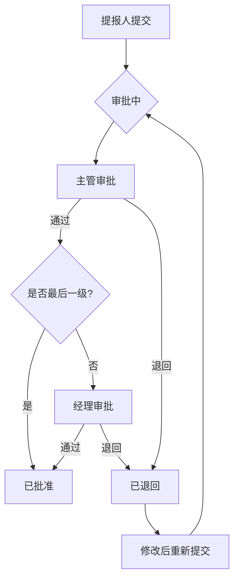
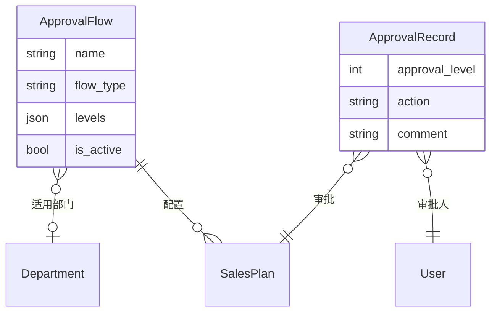

# Approvals 模块 - 审批流程

> 🏠 [返回根目录](../../CLAUDE.md)

## 模块概述

审批流程模块，实现多级审批流程配置和审批记录管理。

---

## 文件结构

```
core/approvals/
├── __init__.py
├── models.py         # ApprovalRecord, ApprovalFlow
├── views.py          # 审批操作
├── urls.py           # 路由配置
├── admin.py          # Admin 配置
├── apps.py           # App 配置
└── migrations/       # 数据库迁移
```

---

## 数据模型

### ApprovalFlow (审批流程配置)

```python
class ApprovalFlow(models.Model):
    class FlowType(models.TextChoices):
        SALES_PLAN = 'sales_plan', '销售计划审批'

    name = models.CharField('流程名称', max_length=100)
    flow_type = models.CharField('流程类型', choices=FlowType.choices)
    department = models.ForeignKey(Department, null=True, ...)  # 为空表示全局默认
    levels = models.JSONField('审批层级配置', default=list)
    # 例如: [{"level": 1, "role": "supervisor"}, {"level": 2, "role": "manager"}]
    is_active = models.BooleanField('是否启用', default=True)
```

**关键方法**:
- `get_approver_for_level(level, submitter)`: 获取指定层级的审批人

### ApprovalRecord (审批记录)

```python
class ApprovalRecord(models.Model):
    class Action(models.TextChoices):
        APPROVE = 'approve', '通过'
        REJECT = 'reject', '退回'

    plan = models.ForeignKey(SalesPlan, related_name='approvals', ...)
    approver = models.ForeignKey(User, related_name='approval_records', ...)
    approval_level = models.IntegerField('审批层级')
    action = models.CharField('审批动作', choices=Action.choices)
    comment = models.TextField('审批意见', blank=True)
    created_at = models.DateTimeField(auto_now_add=True)
```

---

## 审批流程说明

### 默认两级审批

```
提报人 → 主管审批 (Level 1) → 经理审批 (Level 2) → 已批准
```

### 审批人获取规则

1. **第一级审批 (Level 1)**:
   - 优先获取提报人的直属上级 (`submitter.manager`)

2. **第二级审批 (Level 2)**:
   - 获取提报人部门的经理 (`submitter.department.manager`)
   - 如果部门无经理，按角色查找 MANAGER

3. **管理员 (ADMIN)**:
   - 拥有全局审批权限，可审批任意计划

---

## 路由设计

| 路径 | 视图 | 说明 |
|------|------|------|
| `/approvals/` | approval_center | 审批中心首页 |
| `/approvals/pending/` | pending_approvals | 待审批列表 |
| `/approvals/my-requests/` | my_requests | 我发起的请求 |
| `/approvals/history/` | approval_history | 审批历史 |
| `/approvals/<int:plan_id>/approve/` | approve_plan | 审批通过 (POST) |
| `/approvals/<int:plan_id>/reject/` | reject_plan | 审批退回 (POST) |
| `/approvals/api/pending-count/` | pending_count_api | 待审批数量 API |

---

## 核心视图函数

### approval_center

审批中心首页，展示待办概览。

```python
@login_required
def approval_center(request):
    # 待我审批的计划
    pending_plans = SalesPlan.pending_for_approver(request.user)

    # 我发起的待审批请求
    my_pending_requests = SalesPlan.objects.filter(
        submitter=request.user,
        status=SalesPlan.Status.PENDING
    ).count()
```

### approve_plan

审批通过操作。

```python
@login_required
@require_POST
def approve_plan(request, plan_id):
    plan = get_object_or_404(SalesPlan, pk=plan_id)

    if not plan.can_approve(request.user):
        messages.error(request, '您无法审批此计划！')
        return redirect('approvals:pending')

    current_level = plan.get_current_approval_level()
    max_level = plan.get_max_approval_level()

    # 创建审批记录
    ApprovalRecord.objects.create(
        plan=plan,
        approver=request.user,
        approval_level=current_level,
        action=ApprovalRecord.Action.APPROVE,
        comment=request.POST.get('comment', '')
    )

    # 判断是否完成全部审批
    if current_level >= max_level:
        plan.status = SalesPlan.Status.APPROVED
        plan.approved_at = timezone.now()
    # 否则等待下一级审批
```

### reject_plan

审批退回操作。

```python
@login_required
@require_POST
def reject_plan(request, plan_id):
    # 退回后状态变为 REJECTED
    # 提报人可修改后重新提交
```

### pending_count_api

获取待审批数量，供导航栏徽章使用。

**响应格式**:
```json
{
  "count": 5
}
```

---

## 审批流程图



---

## 模板文件

| 模板路径 | 说明 |
|----------|------|
| `templates/approvals/center.html` | 审批中心首页 |
| `templates/approvals/pending.html` | 待审批列表 |
| `templates/approvals/my_requests.html` | 我的请求 |
| `templates/approvals/history.html` | 审批历史 |
| `templates/approvals/partials/pending_list.html` | 待审批列表片段 |
| `templates/approvals/partials/approval_success.html` | 审批成功提示 |

---

## 使用示例

### 配置审批流程

```python
from core.approvals.models import ApprovalFlow

# 创建部门专属审批流程
flow = ApprovalFlow.objects.create(
    name='华东区销售计划审批',
    flow_type=ApprovalFlow.FlowType.SALES_PLAN,
    department=department,
    levels=[
        {"level": 1, "role": "supervisor"},
        {"level": 2, "role": "manager"},
    ],
    is_active=True,
)
```

### 判断用户是否可审批

```python
plan = SalesPlan.objects.get(pk=1)

if plan.can_approve(request.user):
    # 显示审批按钮
    pass
```

### 获取待审批计划

```python
# SalesPlan 模型提供的类方法
pending_plans = SalesPlan.pending_for_approver(request.user)
for plan in pending_plans:
    print(f"{plan.plan_month} - {plan.submitter.username}")
```

### 记录审批操作

```python
from core.approvals.models import ApprovalRecord

# 通过
ApprovalRecord.objects.create(
    plan=plan,
    approver=request.user,
    approval_level=1,
    action=ApprovalRecord.Action.APPROVE,
    comment='同意'
)

# 退回
ApprovalRecord.objects.create(
    plan=plan,
    approver=request.user,
    approval_level=1,
    action=ApprovalRecord.Action.REJECT,
    comment='数量偏高，请核实'
)
```

---

## 数据关系图



---

## 开发注意事项

1. **权限校验**: 审批前必须调用 `plan.can_approve(user)` 校验

2. **流程配置优先级**:
   - 部门专属流程 > 全局默认流程
   - 确保至少有一个全局默认流程

3. **审批层级**: 层级数字越大，审批级别越高

4. **退回处理**: 退回后计划变为 REJECTED 状态，提报人可修改后重新提交

5. **管理员权限**: ADMIN 角色可审批任意计划，不受流程限制

6. **API 轮询**: 前端每分钟调用 `pending_count_api` 更新徽章数字
