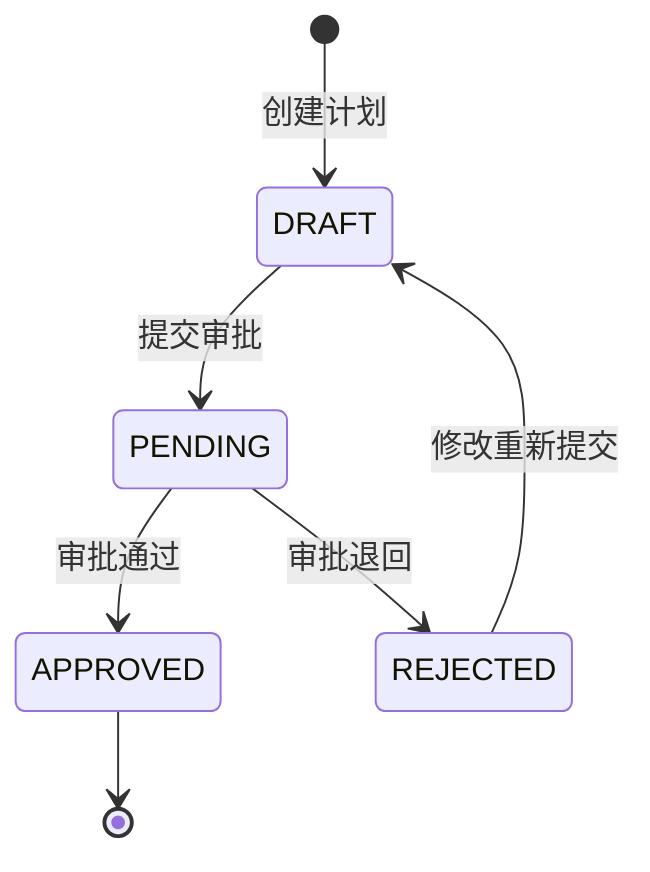
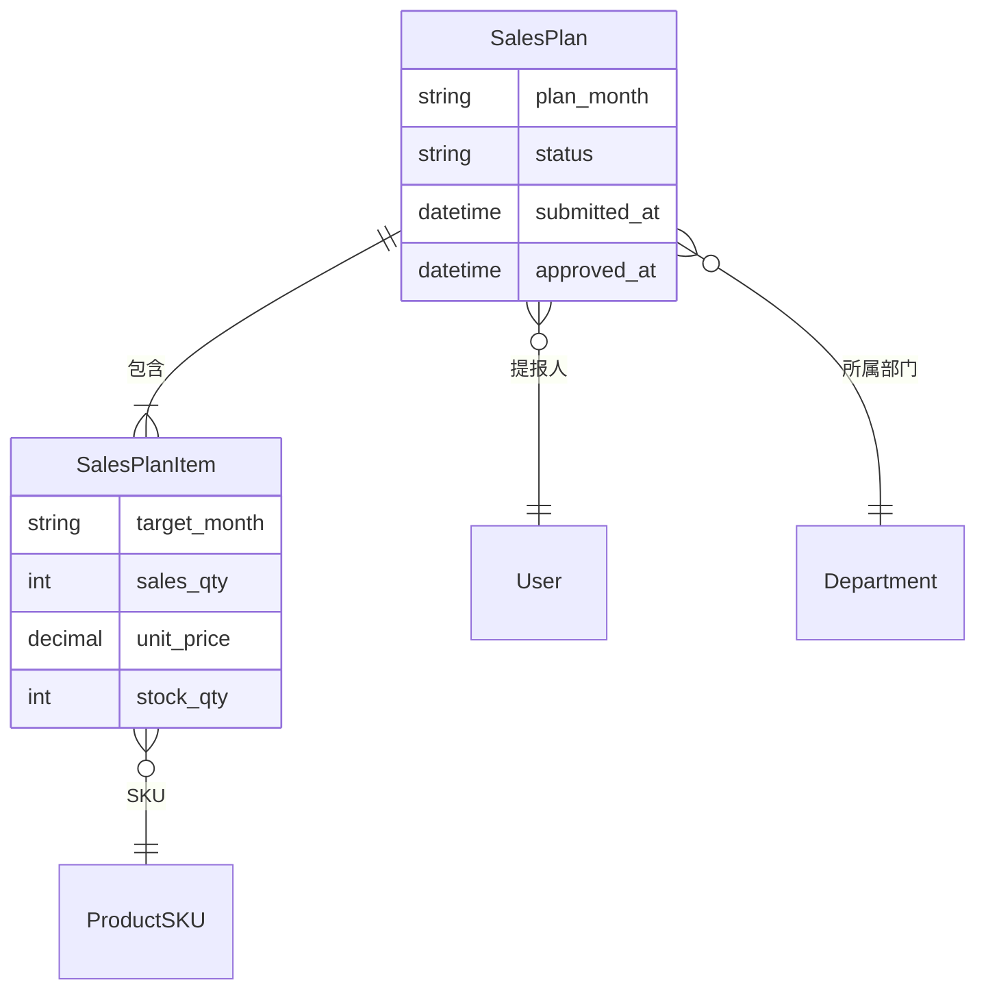

# Plans 模块 - 计划提报

> 🏠 [返回根目录](../../CLAUDE.md)

## 模块概述

销售计划提报模块，核心业务模块，实现 M+4 滚动预测的提报、编辑和报表统计功能。

### M+4 滚动预测说明

M+4 表示在当前月份（M）提报未来4个月（M+1 ~ M+4）的销售预测。

例如：当前 2024-03，则提报 2024-04、2024-05、2024-06、2024-07 的销售计划。

---

## 文件结构

```
core/plans/
├── __init__.py
├── models.py         # SalesPlan, SalesPlanItem
├── views.py          # 计划 CRUD, 报表
├── urls.py           # 路由配置
├── admin.py          # Admin 配置
├── apps.py           # App 配置
├── templatetags/     # 模板标签
│   ├── __init__.py
│   └── plan_tags.py
└── migrations/       # 数据库迁移
```

---

## 数据模型

### SalesPlan (销售计划主表)

```python
class SalesPlan(models.Model):
    class Status(models.TextChoices):
        DRAFT = 'draft', '草稿'
        PENDING = 'pending', '审批中'
        APPROVED = 'approved', '已批准'
        REJECTED = 'rejected', '已退回'

    plan_month = models.CharField('计划月份', max_length=7)  # YYYY-MM
    submitter = models.ForeignKey(User, ...)                 # 提报人
    department = models.ForeignKey(Department, ...)          # 所属部门
    status = models.CharField('状态', default=Status.DRAFT)
    remark = models.TextField('备注', blank=True)
    submitted_at = models.DateTimeField('提交时间', null=True)
    approved_at = models.DateTimeField('批准时间', null=True)

    class Meta:
        unique_together = ['plan_month', 'submitter']  # 每人每月只能有一个计划
```

**关键方法**:
- `get_target_months()`: 获取 M+1 ~ M+4 目标月份列表
- `get_total_amount()`: 计算计划总金额
- `can_edit()`: 是否可编辑（仅草稿状态）
- `can_submit()`: 是否可提交（有明细且为草稿）
- `can_approve(user)`: 指定用户是否可审批
- `get_current_approval_level()`: 当前待审批层级
- `get_current_approver()`: 获取当前审批人
- `submit()`: 提交审批

### SalesPlanItem (计划明细)

```python
class SalesPlanItem(models.Model):
    plan = models.ForeignKey(SalesPlan, related_name='items', ...)
    sku = models.ForeignKey(ProductSKU, ...)
    target_month = models.CharField('目标月份', max_length=7)  # M+1 ~ M+4
    sales_qty = models.IntegerField('销售数量预测', default=0)
    unit_price = models.DecimalField('单价', max_digits=10, decimal_places=2)
    stock_qty = models.IntegerField('库存数量', default=0)
    remark = models.TextField('备注', blank=True)

    class Meta:
        unique_together = ['plan', 'sku', 'target_month']

    @property
    def sales_amount(self):
        return self.sales_qty * self.unit_price
```

---

## 路由设计

| 路径 | 视图 | 说明 |
|------|------|------|
| `/plans/` | plan_list | 所有计划列表 (管理员) |
| `/plans/my/` | my_plans | 我的计划列表 |
| `/plans/create/` | plan_create | 创建新计划 |
| `/plans/<int:pk>/` | plan_detail | 计划详情 |
| `/plans/<int:pk>/edit/` | plan_edit | 编辑计划 |
| `/plans/<int:pk>/delete/` | plan_delete | 删除计划 |
| `/plans/<int:pk>/add-item/` | add_plan_item | 添加明细 (HTMX) |
| `/plans/<int:pk>/items/<int:item_id>/edit/` | edit_plan_item | 编辑明细 |
| `/plans/<int:pk>/items/<int:item_id>/delete/` | delete_plan_item | 删除明细 |
| `/plans/<int:pk>/submit/` | submit_plan | 提交审批 |
| `/plans/reports/` | plan_report | 汇总报表 |
| `/plans/reports/export/` | export_report | 导出 CSV |
| `/plans/api/summary/` | plan_summary_api | 看板数据 API |

---

## 核心视图函数

### dashboard

首页看板，显示当前月份计划概览。

### plan_detail

计划详情页，核心页面，展示 M+4 各月份的明细数据。

```python
@login_required
def plan_detail(request, pk):
    plan = get_object_or_404(SalesPlan, pk=pk)

    # 按月份分组明细
    target_months = plan.get_target_months()  # ['2024-04', '2024-05', '2024-06', '2024-07']
    items_by_month = {}
    for month in target_months:
        items_by_month[month] = plan.items.filter(target_month=month)

    context = {
        'plan': plan,
        'target_months': target_months,
        'items_by_month': items_by_month,
        'can_edit': plan.can_edit() and plan.submitter == request.user,
        'can_submit': plan.can_submit() and plan.submitter == request.user,
    }
```

### plan_report

计划汇总报表，支持按部门/品牌/品类分组统计。

```python
@login_required
def plan_report(request):
    plan_month = request.GET.get('month', timezone.now().strftime('%Y-%m'))
    group_by = request.GET.get('group_by', 'department')  # department/brand/category

    # 仅统计已批准的计划
    plans = SalesPlan.objects.filter(
        plan_month=plan_month,
        status=SalesPlan.Status.APPROVED
    )
```

### plan_summary_api

首页看板 API，返回统计数据。

**响应格式**:
```json
{
  "current_month": "2024-03",
  "total_plans": 50,
  "pending_plans": 10,
  "approved_plans": 35,
  "my_plans": 1,
  "pending_approval": 5
}
```

---

## 状态流转



---

## 模板文件

| 模板路径 | 说明 |
|----------|------|
| `templates/dashboard.html` | 首页看板 |
| `templates/plans/my_plans.html` | 我的计划列表 |
| `templates/plans/plan_form.html` | 计划表单 |
| `templates/plans/plan_detail.html` | 计划详情 |
| `templates/plans/report.html` | 汇总报表 |
| `templates/plans/partials/item_row.html` | 明细行 (HTMX) |
| `templates/plans/partials/add_item_form.html` | 添加明细表单 |
| `templates/plans/partials/edit_item_form.html` | 编辑明细表单 |
| `templates/plans/partials/plan_table.html` | 计划表格 |

---

## 数据关系图



---

## 使用示例

### 创建计划并添加明细

```python
from django.utils import timezone
from core.plans.models import SalesPlan, SalesPlanItem
from core.products.models import ProductSKU

# 创建计划
plan = SalesPlan.objects.create(
    plan_month=timezone.now().strftime('%Y-%m'),
    submitter=request.user,
    department=request.user.department,
)

# 获取目标月份
target_months = plan.get_target_months()  # ['2024-04', '2024-05', '2024-06', '2024-07']

# 添加明细
sku = ProductSKU.objects.get(sku_code='SKU001')
for month in target_months:
    SalesPlanItem.objects.create(
        plan=plan,
        sku=sku,
        target_month=month,
        sales_qty=100,
        unit_price=sku.unit_price,
    )
```

### 提交审批

```python
if plan.can_submit():
    plan.submit()  # 状态变为 PENDING
```

### 获取待审批计划

```python
# 获取当前用户需要审批的计划
pending_plans = SalesPlan.pending_for_approver(request.user)
```

---

## 开发注意事项

1. **唯一性约束**: `plan_month` + `submitter` 唯一，每人每月只能有一个计划

2. **明细唯一性**: `plan` + `sku` + `target_month` 唯一

3. **权限控制**:
   - 只能编辑/删除自己的计划
   - 只有草稿状态可以编辑
   - 管理员可查看所有计划

4. **HTMX 集成**: 明细的增删改使用 HTMX 局部刷新

5. **报表权限**: 报表仅统计已批准状态的计划
