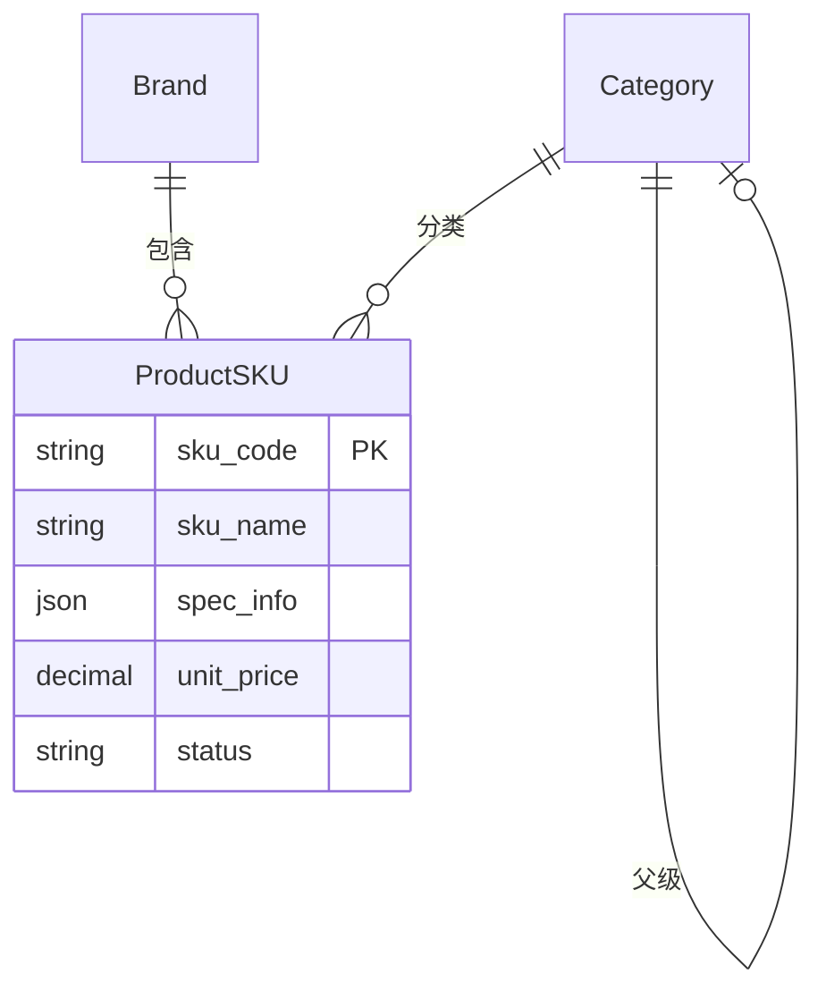

# Products 模块 - 商品管理

> 🏠 [返回根目录](../../CLAUDE.md)

## 模块概述

商品管理模块，提供品牌、品类和 SKU 的完整 CRUD 操作，支持批量导入导出。

---

## 文件结构

```
core/products/
├── __init__.py
├── models.py         # Brand, Category, ProductSKU
├── views.py          # SKU CRUD, 导入导出
├── urls.py           # 路由配置
├── admin.py          # Admin 配置
├── apps.py           # App 配置
└── migrations/       # 数据库迁移
```

---

## 数据模型

### Brand (品牌)

```python
class Brand(models.Model):
    name = models.CharField('品牌名称', max_length=100, unique=True)
    code = models.CharField('品牌编码', max_length=50, unique=True)
    description = models.TextField('品牌描述', blank=True)
    is_active = models.BooleanField('是否启用', default=True)
```

### Category (品类)

```python
class Category(models.Model):
    name = models.CharField('品类名称', max_length=100)
    code = models.CharField('品类编码', max_length=50, unique=True)
    parent = models.ForeignKey('self', ...)  # 支持层级品类
    is_active = models.BooleanField('是否启用', default=True)
```

### ProductSKU (商品SKU)

```python
class ProductSKU(models.Model):
    class Status(models.TextChoices):
        ACTIVE = 'active', '在售'
        INACTIVE = 'inactive', '停售'
        OUT_OF_STOCK = 'out_of_stock', '缺货'

    sku_code = models.CharField('SKU编码', max_length=50, unique=True)
    sku_name = models.CharField('SKU名称', max_length=200)
    brand = models.ForeignKey(Brand, ...)
    category = models.ForeignKey(Category, ...)
    spu_code = models.CharField('SPU编码', max_length=50, blank=True)
    spec_info = models.JSONField('规格信息', default=dict)  # 如: {"颜色": "红色", "容量": "50ml"}
    unit = models.CharField('单位', max_length=20, default='件')
    unit_price = models.DecimalField('单价', max_digits=10, decimal_places=2)
    cost_price = models.DecimalField('成本价', max_digits=10, decimal_places=2)
    status = models.CharField('状态', choices=Status.choices, default=Status.ACTIVE)
```

**关键方法**:
- `get_spec_display()`: 获取规格显示文本 (如: "颜色:红色 / 容量:50ml")
- `is_active`: 属性，判断是否在售

---

## 路由设计

| 路径 | 视图 | 说明 |
|------|------|------|
| `/products/` | sku_list | SKU 列表（支持搜索/过滤/分页） |
| `/products/create/` | sku_create | 创建 SKU |
| `/products/<int:pk>/` | sku_detail | SKU 详情 |
| `/products/<int:pk>/edit/` | sku_edit | 编辑 SKU |
| `/products/<int:pk>/delete/` | sku_delete | 删除 SKU |
| `/products/import/` | sku_import | 批量导入 |
| `/products/export/` | sku_export | 导出 CSV |
| `/products/api/search/` | sku_search_api | SKU 搜索 API (HTMX) |

---

## 视图函数

### sku_list

列表页面，支持多条件过滤和 HTMX 局部刷新。

**过滤条件**:
- `search`: SKU编码/名称模糊搜索
- `status`: 状态过滤
- `brand`: 品牌过滤
- `category`: 品类过滤

**分页**: 每页 20 条

```python
@login_required
def sku_list(request):
    # HTMX 请求返回部分模板
    if request.htmx:
        return render(request, 'products/partials/sku_table.html', context)
    return render(request, 'products/sku_list.html', context)
```

### sku_import

批量导入 SKU，支持 CSV 格式。

**CSV 字段**:
- `sku_code` (必填)
- `sku_name`
- `brand_code` / `brand_name`
- `category_code` / `category_name`
- `unit_price`
- `status`

```python
@login_required
def sku_import(request):
    # 自动创建品牌和品类（如果不存在）
    # 使用 update_or_create 支持更新
```

### sku_search_api

SKU 搜索 API，供 HTMX 使用。

**响应格式**:
```json
{
  "results": [
    {
      "id": 1,
      "text": "SKU001 - 商品名称",
      "sku_code": "SKU001",
      "sku_name": "商品名称",
      "unit_price": "99.00"
    }
  ]
}
```

---

## 模板文件

| 模板路径 | 说明 |
|----------|------|
| `templates/products/sku_list.html` | SKU 列表页 |
| `templates/products/sku_form.html` | SKU 表单页 |
| `templates/products/sku_detail.html` | SKU 详情页 |
| `templates/products/sku_import.html` | 导入页面 |
| `templates/products/partials/sku_table.html` | 表格片段 (HTMX) |

---

## 数据关系图



---

## 使用示例

### 获取在售 SKU

```python
active_skus = ProductSKU.objects.filter(status=ProductSKU.Status.ACTIVE)
```

### 搜索 SKU

```python
from django.db.models import Q

results = ProductSKU.objects.filter(
    Q(sku_code__icontains=query) | Q(sku_name__icontains=query)
)
```

### 规格信息操作

```python
sku = ProductSKU.objects.get(sku_code='SKU001')
sku.spec_info = {"颜色": "红色", "容量": "50ml", "适用肤质": "干性"}
sku.save()

# 获取规格显示
print(sku.get_spec_display())  # "颜色:红色 / 容量:50ml / 适用肤质:干性"
```

---

## 开发注意事项

1. **JSON 字段**: `spec_info` 使用 JSONField，支持灵活的规格存储

2. **导入逻辑**: 品牌和品类会自动创建，使用 `get_or_create` 和 `update_or_create`

3. **分页**: 列表默认每页 20 条，可通过 URL 参数 `page` 切换页码

4. **HTMX 集成**: 列表页支持 HTMX 局部刷新，减少页面重载
