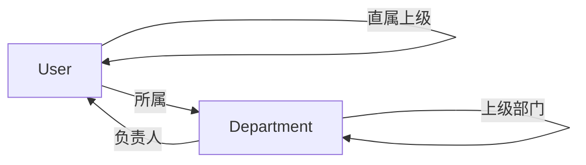

# Users 模块 - 用户管理

> 🏠 [返回根目录](../../CLAUDE.md)

## 模块概述

用户管理模块，提供用户认证、部门管理和角色权限功能。

---

## 文件结构

```
core/users/
├── __init__.py
├── models.py         # User, Department 模型
├── views.py          # 用户资料视图
├── urls.py           # 路由配置
├── admin.py          # Admin 配置
├── apps.py           # App 配置
└── migrations/       # 数据库迁移
```

---

## 数据模型

### User (用户模型)

继承自 `AbstractUser`，扩展角色和部门字段。

```python
class User(AbstractUser):
    class Role(models.TextChoices):
        ADMIN = 'admin', '系统管理员'
        MANAGER = 'manager', '经理'
        SUPERVISOR = 'supervisor', '主管'
        STAFF = 'staff', '普通员工'

    phone = models.CharField('手机号', max_length=20, blank=True)
    avatar = models.ImageField('头像', upload_to='avatars/', blank=True, null=True)
    department = models.ForeignKey(Department, ...)
    role = models.CharField('角色', choices=Role.choices, default=Role.STAFF)
    manager = models.ForeignKey('self', ...)  # 直属上级
```

**关键方法**:
- `get_approval_level()`: 获取审批层级 (0-99)
- `is_approver()`: 判断是否为审批人角色

### Department (部门模型)

```python
class Department(models.Model):
    name = models.CharField('部门名称', max_length=100)
    code = models.CharField('部门编码', max_length=50, unique=True)
    parent = models.ForeignKey('self', ...)  # 上级部门
    manager = models.ForeignKey(User, ...)   # 部门负责人
    is_active = models.BooleanField(default=True)
```

**关键方法**:
- `get_full_path()`: 获取完整部门路径 (如: "集团 > 销售部 > 华东区")

---

## 角色权限矩阵

| 角色 | 层级 | 权限说明 |
|------|------|----------|
| STAFF | 0 | 提报自己的计划 |
| SUPERVISOR | 1 | 一级审批（主管审批） |
| MANAGER | 2 | 二级审批（经理审批） |
| ADMIN | 99 | 全局管理权限 |

---

## 路由设计

| 路径 | 视图 | 说明 |
|------|------|------|
| `/login/` | LoginView | 用户登录 |
| `/logout/` | LogoutView | 用户登出 |
| `/profile/` | profile_view | 用户资料页面 |

---

## 视图函数

### profile_view

用户资料页面，支持 POST 更新个人资料。

```python
@login_required
def profile_view(request):
    # 更新: first_name, last_name, email, phone
```

---

## 模板文件

| 模板路径 | 说明 |
|----------|------|
| `templates/users/login.html` | 登录页面 |
| `templates/users/profile.html` | 用户资料页面 |

---

## 使用示例

### 获取用户的审批人

```python
user = request.user

# 获取直属上级
direct_manager = user.manager

# 获取部门经理
dept_manager = user.department.manager if user.department else None

# 判断是否为审批人
if user.is_approver():
    # 显示审批相关功能
    pass
```

### 审批层级判断

```python
level = user.get_approval_level()
if level >= 1:
    # 可以进行一级审批
    pass
if level >= 2:
    # 可以进行二级审批
    pass
```

---

## 数据关系图



---

## 开发注意事项

1. **自定义用户模型**: 项目使用 `AUTH_USER_MODEL = 'users.User'`，创建外键时应使用 `settings.AUTH_USER_MODEL`

2. **迁移顺序**: 首次迁移时，Department 和 User 存在循环引用，需要分步处理

3. **头像上传**: 确保 `MEDIA_ROOT` 和 `MEDIA_URL` 配置正确
